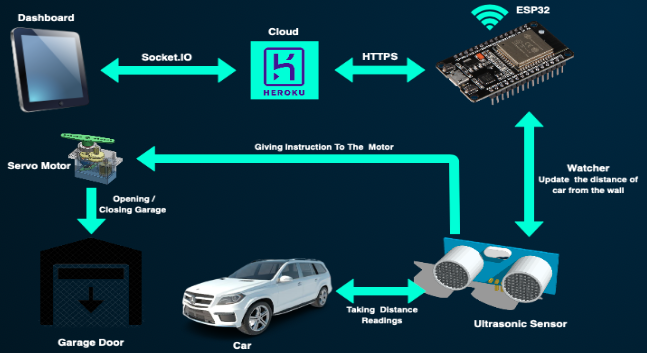
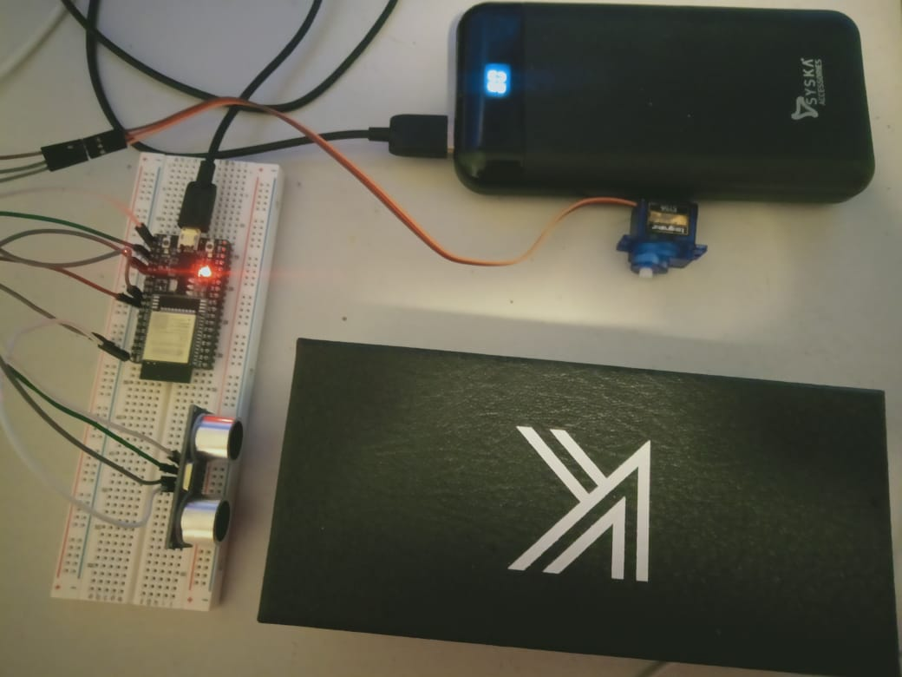

# Smart Car Parking System
This is a simple code for getting the data from ADXL345 and Ultrasonic Sensor using ESP32 and Sending the data directly to server via HTTP request.

Here we are using ESP32 to communicate to the Heroku Server for sending the distance from the Ultrasonic sensor and show the update on the live dashboard using live website.

# Sensors and Gadgets Used:
1. Ultrasonic sensor
2. ESP 32
3. ADXL 345
4. Servo Motor

Connected Cloud Link: "https://github.com/Adityasiwan007/IOT-Home-Automation-Backend"

## Architecture:
 

## Prototype for UltraSonic Car Parking System
Follow the instruction given in link "https://randomnerdtutorials.com/esp32-http-get-post-arduino/"

    

